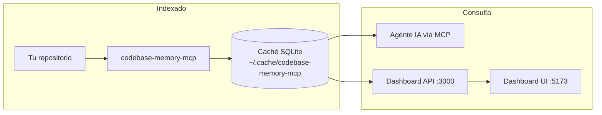
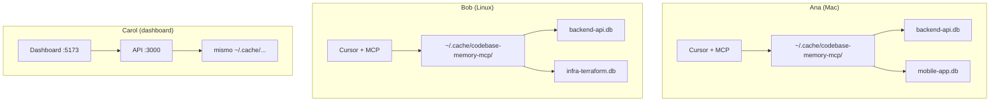
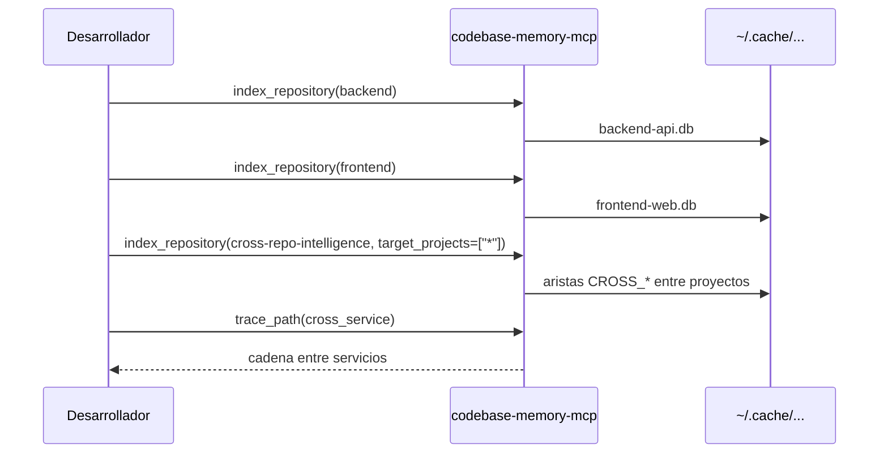

# Uso multiusuario y multiproyecto

Este documento describe cómo se comporta **codebase-memory-mcp** cuando varias personas consultan varios repositorios. El modelo actual es **local por máquina**: no hay servidor central ni autenticación; cada desarrollador mantiene su propio índice y lo consulta vía MCP o dashboard.

---

## Modelo mental: un cerebro por máquina, muchos proyectos

Cada instalación del MCP escribe en un directorio de caché local:

```
~/.cache/codebase-memory-mcp/     # o CBM_CACHE_DIR si está definido
├── backend-api.db                # un proyecto indexado
├── mobile-app.db
├── shared-libs.db
└── ...
```

- **Un archivo `.db` = un proyecto indexado** (grafo SQLite independiente).
- `list_projects` escanea esa carpeta; no existe un registro central compartido.
- Dentro de cada `.db`, nodos y aristas llevan un campo `project`, pero en la práctica el aislamiento es por archivo.



---

## Varias personas en el mismo equipo

### Escenario típico



| Quién | Qué hace | Qué ve |
|-------|----------|--------|
| **Ana** | Pregunta al agente sobre el backend | `search_graph(project="...", ...)` sobre su índice local |
| **Bob** | Pregunta sobre infraestructura | `trace_path(project="...", ...)` sobre sus proyectos indexados |
| **Carol** | Abre el dashboard | Lista todos los `.db` locales y selecciona uno |

**Por defecto no comparten conocimiento**: cada persona tiene su propia caché. El código no sale de la máquina durante indexado y consultas (ver [SECURITY.md](SECURITY.md)).

### Setup inicial por persona

1. Instalar y configurar el MCP en el editor: `codebase-memory-mcp install`
2. Indexar los repos que use: `index_repository(repo_path="...")`
3. El agente consulta con `list_projects` y luego pasa `project` en cada herramienta

---

## Varios proyectos en la misma máquina

Un desarrollador con varios repos indexados verá algo así al llamar `list_projects`:

```json
{
  "projects": [
    {
      "name": "Users-dev-backend",
      "root_path": "/Users/dev/backend",
      "nodes": 42000,
      "edges": 185000
    },
    {
      "name": "Users-dev-frontend",
      "root_path": "/Users/dev/frontend",
      "nodes": 31000,
      "edges": 92000
    }
  ]
}
```

### Flujo del agente

1. **`list_projects`** — comprobar qué hay indexado
2. **`get_graph_schema`** (opcional) — entender tipos de nodo y arista
3. **Consulta con `project` explícito** — casi todas las herramientas lo requieren:
   - `search_graph`, `trace_path`, `get_code_snippet`
   - `query_graph`, `get_architecture`, `search_code`
   - `detect_changes`, `manage_adr`, `ingest_traces`
4. **Paginación** — revisar `has_more` y `total` en respuestas amplias

### Auto-indexado por sesión

Si el MCP arranca con el directorio de trabajo dentro de un repo, puede:

- Detectar la raíz de sesión desde el CWD
- Derivar el nombre del proyecto desde la ruta absoluta
- Indexar en segundo plano si ese proyecto aún no existe en caché
- Registrar un watcher para cambios git

Esto ayuda al uso diario, pero **no sustituye** a `list_projects` cuando hay muchos repos o el agente trabaja fuera del repo indexado.

### Dashboard (`Dashboard/`)

El API y la UI leen el **mismo directorio de caché** (`CBM_CACHE_DIR` o `~/.cache/codebase-memory-mcp`):

- `GET /api/projects` — lista proyectos (equivalente visual a `list_projects`)
- `GET /api/projects/:name/graph` — grafo para exploración
- La UI permite seleccionar el proyecto activo

Variables útiles:

| Variable | Efecto |
|----------|--------|
| `CBM_CACHE_DIR` | Directorio de los `.db` (MCP y dashboard) |
| `CBM_PROJECT` | Proyecto activo por defecto en el API |
| `CBM_API_HOST` / `CBM_API_PORT` | Host y puerto del API (default `127.0.0.1:3000`) |

---

## Nombres de proyecto

El nombre se **deriva de la ruta absoluta** del repositorio (caracteres no seguros se normalizan a `-`).

| Ruta en Ana | Nombre derivado |
|-------------|-----------------|
| `/Users/ana/dev/backend` | `Users-ana-dev-backend` |

| Ruta en Bob (mismo repo, otra máquina) | Nombre derivado |
|--------------------------------------|-----------------|
| `/home/bob/work/backend` | `home-bob-work-backend` |

**Mismo código, nombres distintos** si las rutas difieren.

### Convención recomendada para equipos

Forzar un nombre común al indexar:

```json
{
  "repo_path": "/path/to/backend",
  "name": "backend-api"
}
```

Así scripts, documentación y consultas del agente pueden referir siempre `project: "backend-api"`.

---

## Compartir el índice entre personas

### Artefactos en el repositorio (recomendado)

Al indexar con `persistence: true`, se exporta un artefacto comprimido al repo:

```
mi-repo/
└── .codebase-memory/
    ├── graph.db.zst
    └── artifact.json
```

| Rol | Acción |
|-----|--------|
| **Quien indexa** | `index_repository` con `persistence: true`; commitea el artefacto |
| **Compañeros** | Clonan el repo e importan el artefacto en lugar de re-indexar todo |

Ventajas:

- Onboarding más rápido
- Mismo grafo estructural para todos (misma versión del código)
- No requiere infraestructura compartida

### Caché compartida (avanzado)

Definir `CBM_CACHE_DIR` apuntando a un volumen compartido (NFS, carpeta de equipo, etc.). **No es el caso de uso principal documentado**: SQLite en red puede tener limitaciones de concurrencia; conviene un solo escritor (p. ej. CI) y lectores locales o copias periódicas.

---

## Análisis entre repositorios (cross-repo)

Para microservicios, API + frontend, o varios repos relacionados:

1. Indexar cada repo por separado (`index_repository` en cada uno)
2. Ejecutar modo **`cross-repo-intelligence`** en uno de ellos con `target_projects`:
   - Lista concreta: `["backend-api", "frontend-web"]`
   - Todos los indexados: `["*"]`
3. Consultar con `trace_path(mode="cross_service")` o Cypher sobre aristas `CROSS_HTTP_CALLS`, `CROSS_ASYNC_CALLS`, etc.



---

## Ejemplo: un día de trabajo en equipo

**Contexto:** 3 desarrolladores, 4 repos (API, web, mobile, libs compartidas).

| Momento | Qué ocurre |
|---------|------------|
| **Setup** | Cada uno ejecuta `codebase-memory-mcp install` en su editor |
| **Indexado** | Cada uno indexa los repos que usa, con `name` acordado por el equipo |
| **Pregunta de Ana** | «¿Quién llama a `createPayment`?» → `list_projects` → `backend-api` → `trace_path` |
| **Pregunta de Bob** | «¿Cómo conecta el frontend con la API?» → indexar ambos → `cross-repo-intelligence` |
| **Exploración** | Alguien levanta `Dashboard` y navega el grafo del proyecto elegido |
| **Onboarding** | Nuevo dev clona repos con `.codebase-memory/graph.db.zst` ya commiteado |

---

## Mantenimiento del índice

| Mecanismo | Comportamiento |
|-----------|----------------|
| **Re-indexado manual** | `index_repository` de nuevo sobre el mismo `repo_path` |
| **Watcher (git)** | Detecta cambios vía `git status` / HEAD; re-indexa en background |
| **Repos sin git** | El watcher no hace polling automático; re-indexar manualmente |
| **Borrar proyecto** | `delete_project` elimina el `.db` de la caché |
| **Estado** | `index_status` para nodos, aristas y fecha de indexado |

---

## Limitaciones actuales

| Aspecto | Comportamiento |
|---------|----------------|
| **Usuarios y permisos** | No hay cuentas ni RBAC; quien accede a la caché local ve todos los proyectos indexados ahí |
| **Servidor central** | No hay API multiusuario en la nube; MCP y dashboard son locales |
| **Concurrencia multi-máquina** | Sin coordinación de escrituras entre equipos (salvo artefactos o caché compartida manual) |
| **Nombres de proyecto** | Dependen de la ruta salvo override con `name` |
| **Sincronización en tiempo real** | Cada máquina actualiza su índice según su watcher o re-indexados locales |

---

## Resumen

| Pregunta | Respuesta |
|----------|-----------|
| ¿Varias personas pueden usarlo? | Sí, cada una con su MCP y su caché local |
| ¿Varios proyectos a la vez? | Sí, un `.db` por proyecto en `~/.cache/codebase-memory-mcp/` |
| ¿Cómo sabe el agente qué proyecto consultar? | `list_projects` + parámetro `project` en cada herramienta |
| ¿Cómo comparten el conocimiento? | Artefactos en git (`persistence: true`) o `CBM_CACHE_DIR` compartido |
| ¿Análisis entre repos? | Modo `cross-repo-intelligence` + `trace_path(cross_service)` |

En una frase: **es un cerebro local por desarrollador, con muchos proyectos en paralelo, y opciones de compartir el índice vía artefactos en git — no un servicio central donde todo el equipo consulta el mismo grafo en la nube.**

---

## Referencias

- [README.md](../README.md) — visión general del proyecto
- [SECURITY.md](SECURITY.md) — acceso a filesystem y comportamiento de red
- [ui-migration-plan.md](ui-migration-plan.md) — API REST del dashboard
- Skill `codebase-memory` — matriz de herramientas MCP y flujos de consulta
