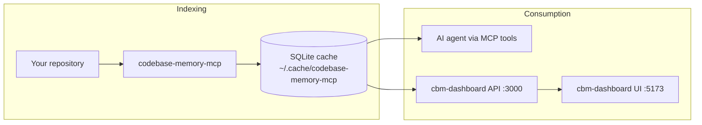

# my-brain

**A local knowledge-graph workspace for AI coding agents** — index any codebase into SQLite, query it via MCP, and explore it in a force-directed graph UI.

This repository combines:

| Component | What it does |
|-----------|--------------|
| **[codebase-memory-mcp](https://github.com/DeusData/codebase-memory-mcp)** | C engine that indexes 158 languages into a knowledge graph (functions, classes, calls, routes, imports…) and exposes **14 MCP tools** to your agent |
| **`cbm-dashboard/`** | Standalone **React dashboard** (this fork) — REST API + 2D graph explorer, independent of the embedded 3D UI |

Everything runs **locally**. Your code never leaves your machine.

<p align="center">
  
  <br>
  <em>Graph exploration — embedded 3D UI (upstream) or the new 2D dashboard in <code>cbm-dashboard/</code></em>
</p>

---

## How it fits together



1. **Index** — `codebase-memory-mcp` parses your repo (tree-sitter + optional LSP) and writes nodes/edges to SQLite.
2. **Query** — Your coding agent uses MCP tools (`search_graph`, `trace_path`, `get_architecture`, …).
3. **Explore** — `cbm-dashboard` reads the same SQLite files and renders an Obsidian-style force-directed graph.

---

## Quick start

### 1 · Install the MCP engine

**macOS / Linux**

```bash
curl -fsSL https://raw.githubusercontent.com/DeusData/codebase-memory-mcp/main/install.sh | bash
```

Restart your agent and say **"Index this project"**.

<details>
<summary>Build from source (this repo)</summary>

```bash
make -f Makefile.cbm
./bin/codebase-memory-mcp install
```

</details>

### 2 · Launch the graph dashboard

Requires **Node 22+** and at least one indexed project in `~/.cache/codebase-memory-mcp/`.

```bash
cd cbm-dashboard
./dev.sh install   # first time only
./dev.sh           # API on :3000 + UI on :5173
```

Open **http://localhost:5173** → select a project → browse **Schema** and **Graph** tabs.

| Command | Description |
|---------|-------------|
| `./dev.sh` | Start API + UI together |
| `./dev.sh api` | API only (`http://127.0.0.1:3000`) |
| `./dev.sh ui` | UI only (proxies `/api` → backend) |

Environment overrides: `CBM_CACHE_DIR`, `CBM_API_PORT`, `CBM_API_HOST`.

---

## cbm-dashboard

Standalone replacement for the embedded 3D UI (`graph-ui/`, `--ui=true`). Talks only to the Node REST API — no dependency on the C HTTP server.

### Stack

- **API** — Fastify + better-sqlite3, read-only access to the MCP cache
- **UI** — React 19, Vite, `react-force-graph-2d` (D3-force canvas)

### Graph view features

- Force-directed layout with zoom, pan, and drag
- Filter by **node label** and **file path prefix**
- Filter by **edge type** (`CALLS`, `IMPORTS`, `HTTP_CALLS`, …)
- **Search** nodes by name / qualified name (visual highlight, no extra HTTP)
- **Local graph** mode — subgraph around a selected node (depth 1–2)
- Side panel with node metadata, degree, and incoming/outgoing edges

Full API contract and usage guide: [docs/ui-migration-plan.md](docs/ui-migration-plan.md).

---

## Repository layout

```text
my-brain/
├── src/              # C core — MCP server, indexer, SQLite store
├── internal/         # Language extractors (tree-sitter grammars)
├── graph-ui/         # Legacy embedded 3D UI (upstream)
├── cbm-dashboard/    # New standalone dashboard (this fork)
│   ├── api/          #   Fastify REST API
│   ├── ui/           #   React SPA
│   └── dev.sh        #   Dev launcher
├── docs/             # All project documentation
├── tests/            # C test suite (5600+ tests)
└── scripts/          # Build, install, CI helpers
```

---

## MCP engine (summary)

Fork of [DeusData/codebase-memory-mcp](https://github.com/DeusData/codebase-memory-mcp) — the fastest structural code-intelligence engine for AI agents.

| | |
|---|---|
| **Indexing** | 158 languages, Hybrid LSP for 9 languages, RAM-first pipeline |
| **Graph** | Functions, classes, calls, imports, HTTP routes, cross-service links |
| **Search** | BM25 FTS5, semantic embeddings (bundled, no API key), Cypher-like queries |
| **Agents** | Auto-configures Claude Code, Codex, Gemini CLI, Cursor, VS Code, and 7 more |
| **Artifact** | Optional `.codebase-memory/graph.db.zst` for team sharing |

Key MCP tools: `search_graph`, `trace_path`, `get_architecture`, `semantic_query`, `detect_changes`, `manage_adr`, `run_cypher`.

For the full feature list, benchmarks, Hybrid LSP details, and distribution channels, see the [upstream README](https://github.com/DeusData/codebase-memory-mcp) and [docs/BENCHMARK.md](docs/BENCHMARK.md).

---

## Documentation

| Document | Contents |
|----------|----------|
| [docs/README.md](docs/README.md) | Documentation index |
| [docs/ui-migration-plan.md](docs/ui-migration-plan.md) | Dashboard API contract + graph UI guide |
| [docs/SECURITY.md](docs/SECURITY.md) | Security policy |
| [docs/CONTRIBUTING.md](docs/CONTRIBUTING.md) | Contribution guidelines |
| [docs/BENCHMARK.md](docs/BENCHMARK.md) | Performance benchmarks |

---

## Development

```bash
# C engine
make -f Makefile.cbm test          # run test suite
make -f Makefile.cbm               # build binary

# Dashboard
cd cbm-dashboard && ./dev.sh       # API + UI with hot reload
```

---

## License

MIT — see [LICENSE](LICENSE).

Based on [codebase-memory-mcp](https://github.com/DeusData/codebase-memory-mcp) by DeusData. Third-party notices: [docs/THIRD_PARTY.md](docs/THIRD_PARTY.md).
