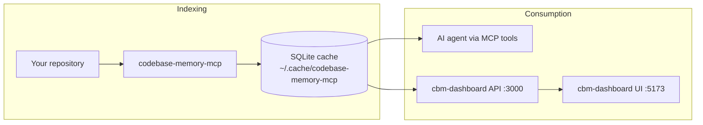

# My Brain

**A local knowledge-graph workspace for AI coding agents** — index any codebase into SQLite, query it via MCP, and explore it in a force-directed graph UI.

This repository combines:

| Component | What it does |
|-----------|--------------|
| **[codebase-memory-mcp](https://github.com/DeusData/codebase-memory-mcp)** | C engine that indexes 158 languages into a knowledge graph (functions, classes, calls, routes, imports…) and exposes **14 MCP tools** to your agent |
| **`cbm-dashboard/`** | Standalone **React dashboard** (this fork) — REST API + 2D graph explorer, independent of the embedded 3D UI |

Everything runs **locally**. Your code never leaves your machine.

---

## How it fits together

1. **Index** — `codebase-memory-mcp` parses your repo (tree-sitter + optional LSP) and writes nodes/edges to SQLite.
2. **Query** — Your coding agent uses MCP tools (`search_graph`, `trace_path`, `get_architecture`, …).
3. **Explore** — `cbm-dashboard` reads the same SQLite files and renders an Obsidian-style force-directed graph.

For teams using several repos across several machines, see [docs/MULTI_USER_MULTI_PROJECT.md](docs/MULTI_USER_MULTI_PROJECT.md).

## License

MIT — see [LICENSE](LICENSE).

Based on [codebase-memory-mcp](https://github.com/DeusData/codebase-memory-mcp) by DeusData. Third-party notices: [docs/THIRD_PARTY.md](docs/THIRD_PARTY.md).
