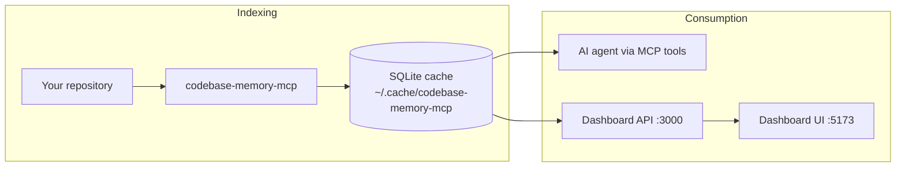

# My Brain

**A local knowledge-graph workspace for AI coding agents** — index any codebase into SQLite, query it via MCP, and explore it in a force-directed graph UI.

This monorepo contains two independent parts:

| Folder | What it does |
|--------|--------------|
| **[MCP/](MCP/)** | C engine that indexes 158 languages into a knowledge graph and exposes **14 MCP tools** to your agent |
| **[Dashboard/](Dashboard/)** | Standalone **React dashboard** — REST API + 2D graph explorer |

Everything runs **locally**. Your code never leaves your machine.

---

## How it fits together



1. **Index** — Build and run the MCP binary (`MCP/`) to parse repos and write nodes/edges to SQLite.
2. **Query** — Your coding agent uses MCP tools (`search_graph`, `trace_path`, `get_architecture`, …).
3. **Explore** — The Dashboard reads the same SQLite files and renders an Obsidian-style force-directed graph.

---

## Quick start

### Dashboard

From the **repo root** (one command starts API + UI):

```powershell
# Windows (PowerShell)
.\dev.ps1
.\dev.ps1 -Open          # also open http://localhost:5173
```

```bash
# Git Bash / WSL / macOS / Linux
./dev.sh
./dev.sh --open
```

Or from `Dashboard/` directly: `./dev.sh` (bash only).

See [Dashboard/README.md](Dashboard/README.md) for API/UI setup and environment variables.

### MCP

```bash
cd MCP
scripts/build.sh      # or: make -f Makefile.cbm cbm
codebase-memory-mcp install
```

See [MCP/README.md](MCP/README.md) for build, test, and MCP tool documentation.

---

## Shared contract

Both parts use the same SQLite cache directory (default `~/.cache/codebase-memory-mcp`). Configure via `CBM_CACHE_DIR`. The Dashboard invokes indexing through `CBM_BINARY` (default: `codebase-memory-mcp` on PATH).

For teams using several repos across several machines, see [docs/MULTI_USER_MULTI_PROJECT.md](docs/MULTI_USER_MULTI_PROJECT.md).

## License

MIT — see [LICENSE](LICENSE).

Based on [codebase-memory-mcp](https://github.com/DeusData/codebase-memory-mcp) by DeusData. Third-party notices: [MCP/docs/THIRD_PARTY.md](MCP/docs/THIRD_PARTY.md).
